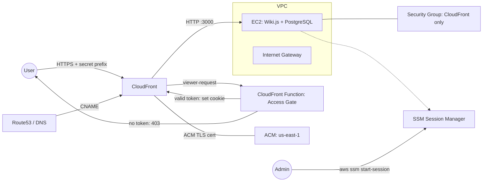

# Wiki.js on AWS

Terraform project to deploy Wiki.js on AWS with CloudFront, EC2, and SSM access.

## Architecture



- **VPC** — Shared services VPC with public/private subnets across 3 AZs
- **EC2** — Amazon Linux 2023 running Wiki.js + PostgreSQL via Docker Compose
- **CloudFront** — TLS termination, no need to manage IP-based security groups
- **CloudFront Function** — Access gate that requires a secret path prefix ("knock") to reach Wiki.js; all other requests receive a generic 403
- **ACM** — DNS-validated certificate (created in us-east-1 for CloudFront)
- **SSM** — Session Manager for shell access (no SSH keys or port 22)

## Prerequisites

- Terraform (`brew install tfenv && tfenv install latest`)
- AWS credentials configured with `AWS_DEFAULT_REGION` set
- Access to create DNS records in your Route53 account (can be a separate account)

## Usage

```bash
cp terraform.tfvars.example terraform.tfvars
# Edit terraform.tfvars with your domain name

terraform init
terraform plan
terraform apply
```

`terraform apply` will pause at the ACM certificate until you create the DNS validation record in your Route53 account. The required records are shown in the output.

Once deployed, create a CNAME or Route53 alias from your domain to the CloudFront distribution domain (also shown in the output).

## Estimated Cost

### Infracost Breakdown

The following is auto-generated by Infracost via the pre-commit hook. It covers resources with deterministic pricing only.

<!-- BEGIN_INFRACOST -->
```
Project: main

 Name                                                       Monthly Qty  Unit                    Monthly Cost

 aws_instance.wiki
 ├─ Instance usage (Linux/UNIX, on-demand, t3.micro)                730  hours                          $9.64
 └─ root_block_device
    └─ Storage (general purpose SSD, gp3)                            20  GB                             $1.92

 aws_cloudfront_distribution.wiki
 ├─ Invalidation requests (first 1k)                  Monthly cost depends on usage: $0.00 per paths
 └─ US, Mexico, Canada
    ├─ Data transfer out to internet (first 10TB)     Monthly cost depends on usage: $0.085 per GB
    ├─ Data transfer out to origin                    Monthly cost depends on usage: $0.02 per GB
    ├─ HTTP requests                                  Monthly cost depends on usage: $0.0075 per 10k requests
    └─ HTTPS requests                                 Monthly cost depends on usage: $0.01 per 10k requests

 aws_cloudfront_function.access_gate
 └─ Total number of invocations                       Monthly cost depends on usage: $0.10 per 1M invocations

 OVERALL TOTAL                                                                                        $11.56

*Usage costs can be estimated by updating Infracost Cloud settings, see docs for other options.

──────────────────────────────────
36 cloud resources were detected:
∙ 3 were estimated
∙ 33 were free

┏━━━━━━━━━━━━━━━━━━━━━━━━━━━━━━━━━━━━━━━━━━━━━━━━━━━━┳━━━━━━━━━━━━━━━┳━━━━━━━━━━━━━┳━━━━━━━━━━━━┓
┃ Project                                            ┃ Baseline cost ┃ Usage cost* ┃ Total cost ┃
┣━━━━━━━━━━━━━━━━━━━━━━━━━━━━━━━━━━━━━━━━━━━━━━━━━━━━╋━━━━━━━━━━━━━━━╋━━━━━━━━━━━━━╋━━━━━━━━━━━━┫
┃ main                                               ┃           $12 ┃           - ┃        $12 ┃
┗━━━━━━━━━━━━━━━━━━━━━━━━━━━━━━━━━━━━━━━━━━━━━━━━━━━━┻━━━━━━━━━━━━━━━┻━━━━━━━━━━━━━┻━━━━━━━━━━━━┛
```
<!-- END_INFRACOST -->

### Additional Costs Not Captured by Infracost

The following are usage-based or recently introduced charges that Infracost does not estimate.

| Resource | Monthly Est (USD) | Notes |
|---|---|---|
| Public IPv4 address | ~$3.65 | AWS charges for all public IPv4 since Feb 2024 |
| CloudFront data transfer + requests | ~$1-2 | Usage-based |
| EC2 data transfer out | ~$1-2 | Usage-based |

Estimates assume minimal traffic for a small internal wiki. These will increase with usage.

**Realistic total: ~$15-20 USD/month**

## SSM Access

```bash
aws ssm start-session --target <instance-id>
```

The instance ID is included in the Terraform outputs.

Code is scanned by both Trivy and Checkov to ensure nothing slips through the net.
This assists in making sure a high level of security is maintained.

## Security Decisions

### No WAF

Both Trivy and Checkov flag the absence of AWS WAF on the CloudFront distribution. AWS WAF adds a minimum of ~$6-10/month (WebACL + rule groups), which nearly doubles the baseline infrastructure cost (~$12/month). For a small internal wiki behind Google OAuth and the CloudFront Function access gate, the cost-benefit does not justify it. This will be reconsidered if the wiki becomes more widely used or handles sensitive data.

### Access Gate

The CloudFront Function acts as a lightweight "knock" layer. Users must know a secret path prefix to reach the site — without it, CloudFront returns a generic 403 with no indication a wiki exists behind it. On first valid request the function sets a `Secure; HttpOnly; SameSite=Strict` session cookie so that subsequent requests (assets, API calls, etc.) pass through without the prefix.

## Terraform Docs

<!-- BEGIN_TF_DOCS -->
## Requirements

| Name | Version |
|------|---------|
| <a name="requirement_terraform"></a> [terraform](#requirement\_terraform) | >= 1.5 |
| <a name="requirement_aws"></a> [aws](#requirement\_aws) | ~> 5.0 |

## Providers

| Name | Version |
|------|---------|
| <a name="provider_aws"></a> [aws](#provider\_aws) | 5.100.0 |
| <a name="provider_aws.us_east_1"></a> [aws.us\_east\_1](#provider\_aws.us\_east\_1) | 5.100.0 |

## Modules

No modules.

## Resources

| Name | Type |
|------|------|
| [aws_acm_certificate.wiki](https://registry.terraform.io/providers/hashicorp/aws/latest/docs/resources/acm_certificate) | resource |
| [aws_acm_certificate_validation.wiki](https://registry.terraform.io/providers/hashicorp/aws/latest/docs/resources/acm_certificate_validation) | resource |
| [aws_cloudfront_distribution.wiki](https://registry.terraform.io/providers/hashicorp/aws/latest/docs/resources/cloudfront_distribution) | resource |
| [aws_cloudfront_function.access_gate](https://registry.terraform.io/providers/hashicorp/aws/latest/docs/resources/cloudfront_function) | resource |
| [aws_cloudfront_response_headers_policy.security](https://registry.terraform.io/providers/hashicorp/aws/latest/docs/resources/cloudfront_response_headers_policy) | resource |
| [aws_default_network_acl.default](https://registry.terraform.io/providers/hashicorp/aws/latest/docs/resources/default_network_acl) | resource |
| [aws_default_security_group.default](https://registry.terraform.io/providers/hashicorp/aws/latest/docs/resources/default_security_group) | resource |
| [aws_iam_instance_profile.wiki](https://registry.terraform.io/providers/hashicorp/aws/latest/docs/resources/iam_instance_profile) | resource |
| [aws_iam_role.scheduler](https://registry.terraform.io/providers/hashicorp/aws/latest/docs/resources/iam_role) | resource |
| [aws_iam_role.wiki](https://registry.terraform.io/providers/hashicorp/aws/latest/docs/resources/iam_role) | resource |
| [aws_iam_role_policy.scheduler](https://registry.terraform.io/providers/hashicorp/aws/latest/docs/resources/iam_role_policy) | resource |
| [aws_iam_role_policy_attachment.ssm](https://registry.terraform.io/providers/hashicorp/aws/latest/docs/resources/iam_role_policy_attachment) | resource |
| [aws_instance.wiki](https://registry.terraform.io/providers/hashicorp/aws/latest/docs/resources/instance) | resource |
| [aws_internet_gateway.main](https://registry.terraform.io/providers/hashicorp/aws/latest/docs/resources/internet_gateway) | resource |
| [aws_network_acl.private](https://registry.terraform.io/providers/hashicorp/aws/latest/docs/resources/network_acl) | resource |
| [aws_network_acl.public](https://registry.terraform.io/providers/hashicorp/aws/latest/docs/resources/network_acl) | resource |
| [aws_route_table.private](https://registry.terraform.io/providers/hashicorp/aws/latest/docs/resources/route_table) | resource |
| [aws_route_table.public](https://registry.terraform.io/providers/hashicorp/aws/latest/docs/resources/route_table) | resource |
| [aws_route_table_association.private](https://registry.terraform.io/providers/hashicorp/aws/latest/docs/resources/route_table_association) | resource |
| [aws_route_table_association.public](https://registry.terraform.io/providers/hashicorp/aws/latest/docs/resources/route_table_association) | resource |
| [aws_scheduler_schedule.wiki_start](https://registry.terraform.io/providers/hashicorp/aws/latest/docs/resources/scheduler_schedule) | resource |
| [aws_scheduler_schedule.wiki_stop](https://registry.terraform.io/providers/hashicorp/aws/latest/docs/resources/scheduler_schedule) | resource |
| [aws_security_group.wiki](https://registry.terraform.io/providers/hashicorp/aws/latest/docs/resources/security_group) | resource |
| [aws_subnet.private](https://registry.terraform.io/providers/hashicorp/aws/latest/docs/resources/subnet) | resource |
| [aws_subnet.public](https://registry.terraform.io/providers/hashicorp/aws/latest/docs/resources/subnet) | resource |
| [aws_vpc.main](https://registry.terraform.io/providers/hashicorp/aws/latest/docs/resources/vpc) | resource |
| [aws_vpc_security_group_egress_rule.all](https://registry.terraform.io/providers/hashicorp/aws/latest/docs/resources/vpc_security_group_egress_rule) | resource |
| [aws_vpc_security_group_ingress_rule.cloudfront](https://registry.terraform.io/providers/hashicorp/aws/latest/docs/resources/vpc_security_group_ingress_rule) | resource |
| [aws_availability_zones.available](https://registry.terraform.io/providers/hashicorp/aws/latest/docs/data-sources/availability_zones) | data source |
| [aws_cloudfront_cache_policy.disabled](https://registry.terraform.io/providers/hashicorp/aws/latest/docs/data-sources/cloudfront_cache_policy) | data source |
| [aws_cloudfront_origin_request_policy.all_viewer](https://registry.terraform.io/providers/hashicorp/aws/latest/docs/data-sources/cloudfront_origin_request_policy) | data source |
| [aws_ec2_managed_prefix_list.cloudfront](https://registry.terraform.io/providers/hashicorp/aws/latest/docs/data-sources/ec2_managed_prefix_list) | data source |
| [aws_region.current](https://registry.terraform.io/providers/hashicorp/aws/latest/docs/data-sources/region) | data source |
| [aws_ssm_parameter.al2023_ami](https://registry.terraform.io/providers/hashicorp/aws/latest/docs/data-sources/ssm_parameter) | data source |

## Inputs

| Name | Description | Type | Default | Required |
|------|-------------|------|---------|:--------:|
| <a name="input_access_token"></a> [access\_token](#input\_access\_token) | Secret path prefix required to access Wiki.js (e.g. 'mysecret123') | `string` | n/a | yes |
| <a name="input_domain_name"></a> [domain\_name](#input\_domain\_name) | Domain name for the Wiki.js site (e.g. wiki.example.com) | `string` | n/a | yes |
| <a name="input_environment"></a> [environment](#input\_environment) | Environment name used for tagging | `string` | `"shared-services"` | no |
| <a name="input_instance_type"></a> [instance\_type](#input\_instance\_type) | EC2 instance type for the Wiki.js server | `string` | `"t3.micro"` | no |
| <a name="input_schedule_enabled"></a> [schedule\_enabled](#input\_schedule\_enabled) | Enable automatic stop/start schedule for the EC2 instance | `bool` | `true` | no |
| <a name="input_vpc_cidr"></a> [vpc\_cidr](#input\_vpc\_cidr) | CIDR block for the shared services VPC | `string` | `"10.0.0.0/16"` | no |

## Outputs

| Name | Description |
|------|-------------|
| <a name="output_acm_validation_records"></a> [acm\_validation\_records](#output\_acm\_validation\_records) | Create these DNS records to validate the ACM certificate |
| <a name="output_cloudfront_distribution_id"></a> [cloudfront\_distribution\_id](#output\_cloudfront\_distribution\_id) | CloudFront distribution ID |
| <a name="output_cloudfront_domain_name"></a> [cloudfront\_domain\_name](#output\_cloudfront\_domain\_name) | Create a CNAME or Route53 alias from var.domain\_name to this value |
| <a name="output_instance_id"></a> [instance\_id](#output\_instance\_id) | EC2 instance ID — connect with: aws ssm start-session --target <id> |
| <a name="output_private_subnet_ids"></a> [private\_subnet\_ids](#output\_private\_subnet\_ids) | n/a |
| <a name="output_public_subnet_ids"></a> [public\_subnet\_ids](#output\_public\_subnet\_ids) | n/a |
| <a name="output_vpc_id"></a> [vpc\_id](#output\_vpc\_id) | n/a |
<!-- END_TF_DOCS -->
